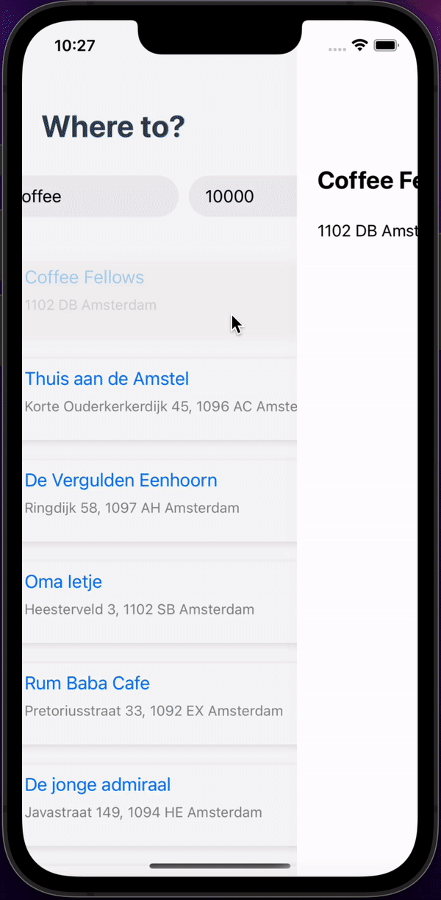
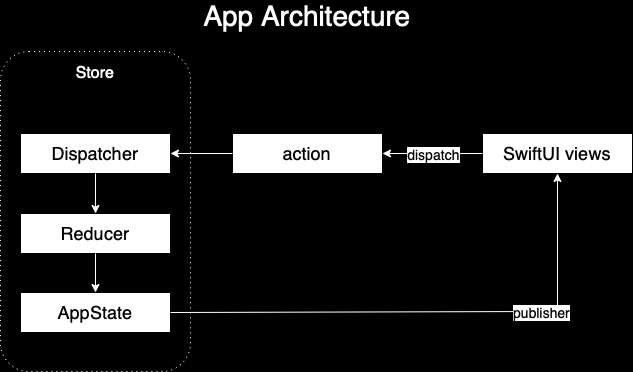

# FindMyPlace App Readme

## Introduction
Introducing the ultimate app for foodies and coffee lovers! Our app helps you discover the best coffee shops, dessert places and much more near you. With just a few taps, you can search for your next meal within a specific radius and find the perfect spot for your next foodie adventure. Whether you're in the mood for a latte, a pasta, or a slice of cake, our app has got you covered. Say goodbye to boring and bland coffee breaks, and start discovering the delicious world of local cafes and bakeries. Download now and let the foodie journey begin!

## Features
- Browse a list of variety of cafes and spots near you
- View pictures of the places suggested by the app
- Search with the place type (coffee, dessert, etc.)
- Search within a radius

# Development
Minimum deployment: iOS 14.0

## TechStack
Swift | SwiftUI | Combine | XCTest

## Targets
- FindMyPlace
- FindMyPlaceUnitTests
- FindMyPlaceUITests

## Architecture
FindMyPlace uses Redux architecture. Redux's core concept is to have a single source of truth for your application's state, making it easier to understand, debug and test.

Redux architecture consists of three main parts:

- Store: The store is the single source of truth for your application's state. You can think of it as a container that holds the current state of your application.
- Actions: Actions are plain objects that represent an event that has taken place in your application. They are used to communicate changes to the store.
- Reducers: Reducers are pure functions that take the current state and an action as input and return the next state. They are responsible for updating the store based on the actions that have taken place.
- Dispatch: Dispatching actions is the process of sending actions to the store so that they can be processed by the reducers and the state can be updated.
- Subscribers: These are the ui views/controllers that subsribe and rerender based on state's changes.

Take a look at the flow chart below:

## Troubleshooting
In case of any difficulties, please don't hesitate to contact me at tateviktome@gmail.com. 

